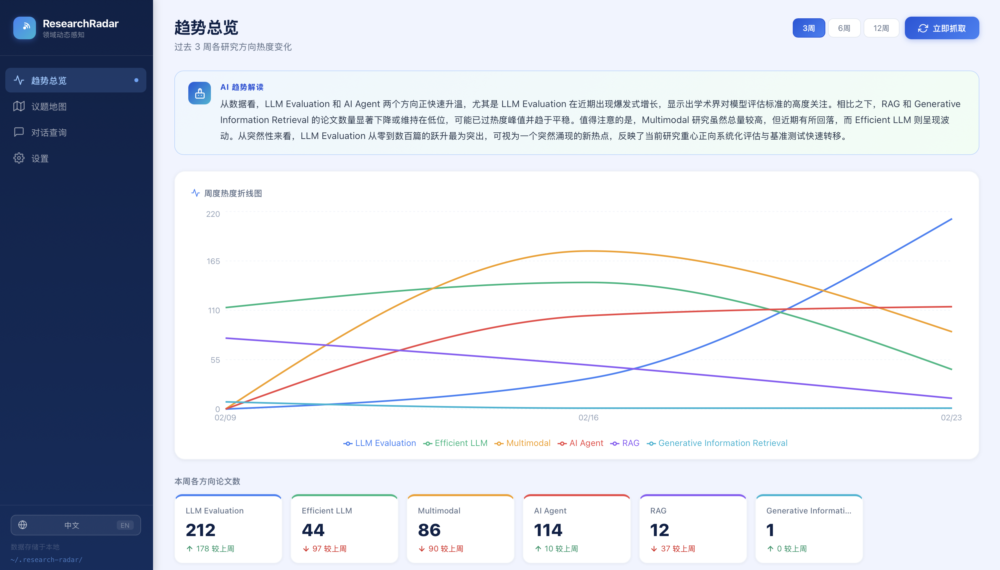
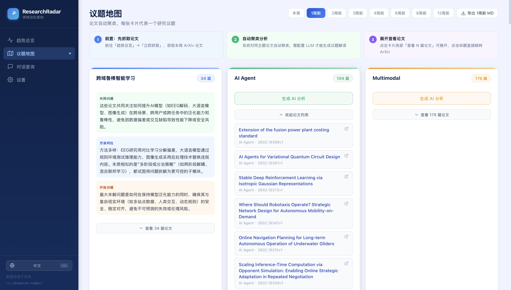
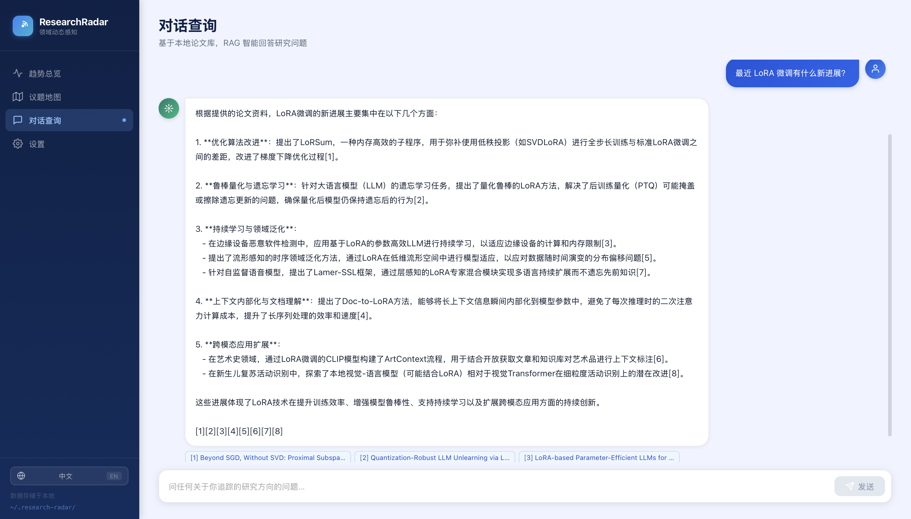
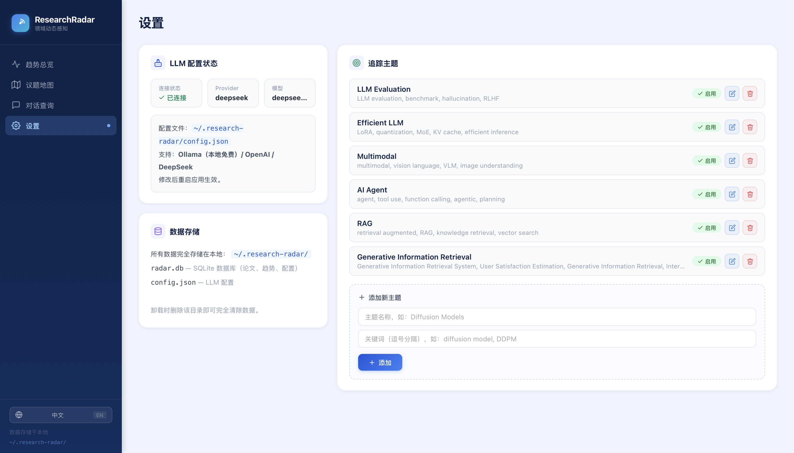

# 🔭 ResearchRadar

<div align="center">

[](LICENSE) [](https://python.org) [](https://react.dev) [](https://arxiv.org)

[English README](README_EN.md)

</div>

> 大多数 ArXiv 工具给你一份**列表**，ResearchRadar 给你一张**地图**。

不是「今天出了哪些论文」，而是「**这个领域正在发生什么**」。

---

## ✦ 核心功能

| 功能 | 说明 |
|------|------|
| 📊 **趋势检测** | 多周折线图，直观看出哪些方向在升温、哪些在降温，LLM 自动解读 |
| 🗂 **议题地图** | 同一议题论文自动聚类，LLM 横向分析方法异同与开放问题 |
| 💬 **对话查询** | 问「最近 XXX 方向有什么进展」，基于本地论文库 RAG 回答 |
| 🌐 **中英双语** | 界面与 AI 分析均支持一键切换语言 |

**🔒 所有数据完全本地存储，不上传任何内容。**

---

## 📸 界面预览

<table>
  <tr>
    <td align="center"><b>📊 趋势总览</b></td>
    <td align="center"><b>🗂 议题地图</b></td>
  </tr>
  <tr>
    <td></td>
    <td></td>
  </tr>
  <tr>
    <td align="center"><b>💬 对话查询</b></td>
    <td align="center"><b>⚙️ 主题配置</b></td>
  </tr>
  <tr>
    <td></td>
    <td></td>
  </tr>
</table>

---

## 🚀 快速开始（3 行命令）

```bash
git clone https://github.com/nova728/research-radar
cd research-radar
bash run.sh
```

浏览器自动打开 → **http://localhost:8765**

> **需要环境：** Python 3.10+，Node.js 18+（前端构建，仅首次约需 1 分钟）

`run.sh` 会自动完成：创建虚拟环境 → 安装依赖 → 构建前端 → 启动服务，**无需任何手动配置**。

---

## ⚙️ LLM 配置（可选但推荐）

不配置 LLM 也可使用（趋势图、论文列表正常工作），但**议题分析和对话查询**需要 LLM。

**第一步：** 运行一次 `bash run.sh` 后，配置文件会自动生成在：

```
~/.research-radar/config.json
```

**第二步：** 用任意文本编辑器打开该文件，按需填写以下配置之一，保存后**重启应用**生效。

> 注意：`llm_provider` 字段决定使用哪个方案，必须与下方对应修改。

<details>
<summary><b>方案 A：Ollama 本地模型（完全免费，需先安装 Ollama）</b></summary>

[下载 Ollama](https://ollama.com) 并运行 `ollama pull qwen2.5:7b`，然后配置：

```json
{
  "llm_provider": "ollama",
  "ollama_model": "qwen2.5:7b",
  "ollama_base_url": "http://localhost:11434",
  "openai_api_key": "",
  "openai_model": "gpt-4o-mini",
  "deepseek_api_key": "",
  "deepseek_model": "deepseek-chat"
}
```
</details>

<details>
<summary><b>方案 B：DeepSeek API（推荐，约 ¥0.001/次）</b></summary>

在 [platform.deepseek.com](https://platform.deepseek.com) 注册并获取 API Key，然后配置：

```json
{
  "llm_provider": "deepseek",
  "ollama_model": "qwen2.5:7b",
  "ollama_base_url": "http://localhost:11434",
  "openai_api_key": "",
  "openai_model": "gpt-4o-mini",
  "deepseek_api_key": "sk-你的key",
  "deepseek_model": "deepseek-chat"
}
```
</details>

<details>
<summary><b>方案 C：OpenAI</b></summary>

在 [platform.openai.com](https://platform.openai.com) 获取 API Key，然后配置：

```json
{
  "llm_provider": "openai",
  "ollama_model": "qwen2.5:7b",
  "ollama_base_url": "http://localhost:11434",
  "openai_api_key": "sk-你的key",
  "openai_model": "gpt-4o-mini",
  "deepseek_api_key": "",
  "deepseek_model": "deepseek-chat"
}
```
</details>

配置完成后在 **Settings** 页面可以查看连接状态是否为 ✅ 已连接。

---

## 🗂 追踪主题配置

在 **Settings → 追踪主题** 中添加你关注的研究方向，例如：

| 主题名 | 关键词示例 |
|--------|-----------|
| LLM Evaluation | LLM evaluation, benchmark, leaderboard |
| AI Agent | AI agent, tool use, function calling |
| RAG | retrieval augmented generation, RAG |

添加后点击「立即抓取」即可获取对应方向的最新论文。

---

## 📁 项目结构

```
research-radar/
├── backend/
│   ├── app/
│   │   ├── main.py                 # FastAPI 入口
│   │   ├── api/                    # REST 接口
│   │   └── agent/
│   │       ├── crawler.py          # ArXiv 抓取
│   │       ├── trend_analyzer.py   # ★ 趋势检测
│   │       ├── cluster_analyzer.py # ★ 议题聚类
│   │       ├── rag_chat.py         # ★ 对话查询 RAG
│   │       ├── llm.py              # LLM 统一封装（Ollama/OpenAI/DeepSeek）
│   │       └── scheduler.py        # 定时任务
│   └── requirements.txt
├── frontend/                       # React 18 + TypeScript + Recharts
├── docs/screenshots/               # 界面截图
├── run.sh                          # 一键启动
├── README.md                       # 中文文档（默认）
└── README_EN.md                    # English documentation
```

---

## 🛠 开发模式

```bash
# 后端
cd backend && pip install -r requirements.txt
python -m app.main --dev --no-browser   # http://localhost:8765

# 前端（另一个终端）
cd frontend && npm install && npm run dev  # http://localhost:5173
```

---

## License

[MIT](LICENSE)
