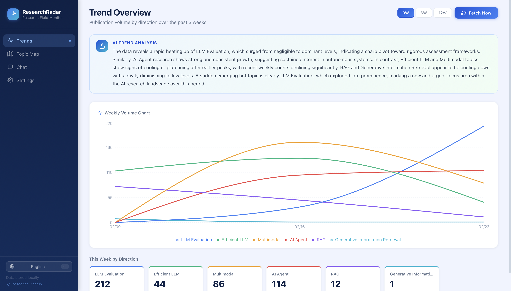
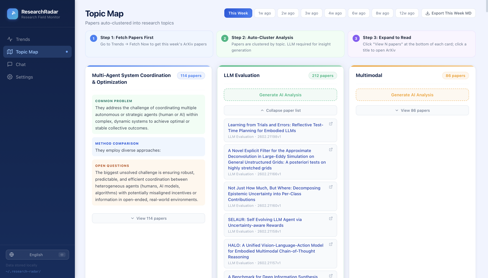
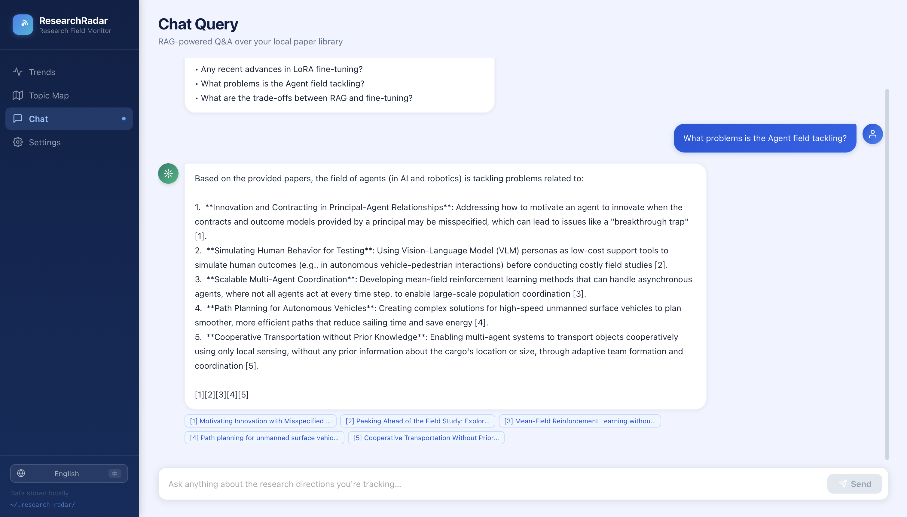
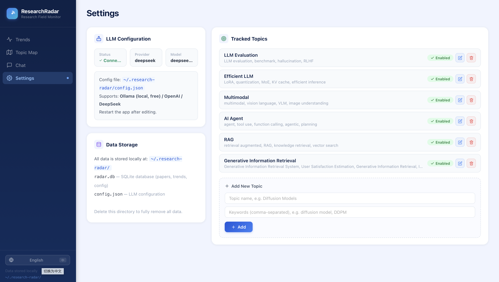

# 🔭 ResearchRadar

<div align="center">

[](LICENSE) [](https://python.org) [](https://react.dev) [](https://arxiv.org)

[中文 README](README.md)

</div>

> Most ArXiv tools give you a **list**. ResearchRadar gives you a **map**.

Not "what papers came out today", but "**what is happening in this field**".

---

## ✦ Features

| Feature | Description |
|---------|-------------|
| 📊 **Trend Detection** | Multi-week line chart showing which directions are heating up or cooling down, with LLM-powered interpretation |
| 🗂 **Topic Map** | Papers auto-clustered by topic; LLM analyzes method differences and open questions across papers |
| 💬 **Chat Query** | Ask "what's new in XXX recently?" — RAG answers based on your local paper library |
| 📋 **Digest Report** | Multi-dimensional scoring selects weekly highlights; LLM writes per-paper analysis; export as Markdown |
| 🌐 **Bilingual** | Full UI and AI analysis in Chinese & English, switchable with one click |

**🔒 All data stored locally. Nothing is uploaded.**

---

## 📸 Screenshots

<table>
  <tr>
    <td align="center"><b>📊 Trend Overview</b></td>
    <td align="center"><b>🗂 Topic Map</b></td>
  </tr>
  <tr>
    <td></td>
    <td></td>
  </tr>
  <tr>
    <td align="center"><b>💬 Chat Query</b></td>
    <td align="center"><b>⚙️ Topic Settings</b></td>
  </tr>
  <tr>
    <td></td>
    <td></td>
  </tr>
</table>

---

## 🚀 Quick Start (3 commands)

```bash
git clone https://github.com/nova728/research-radar
cd research-radar
bash run.sh
```

Browser opens automatically → **http://localhost:8765**

> **Requirements:** Python 3.10+, Node.js 18+ (for frontend build, one-time ~1 min)

`run.sh` handles everything automatically: virtual env → install dependencies → build frontend → launch. **Zero manual configuration.**

---

## ⚙️ LLM Configuration (optional but recommended)

Works without LLM (trend chart and paper list always available), but **topic analysis and chat** require one.

**Step 1:** Run `bash run.sh` once — the config file is automatically created at:

```
~/.research-radar/config.json
```

**Step 2:** Open that file with any text editor, fill in one of the options below, save, and **restart the app**.

> Important: the `llm_provider` field controls which option is active — make sure it matches your chosen config.

<details>
<summary><b>Option A: Ollama local model (completely free, requires Ollama installed)</b></summary>

[Download Ollama](https://ollama.com) and run `ollama pull qwen2.5:7b`, then configure:

```json
{
  "llm_provider": "ollama",
  "ollama_model": "qwen2.5:7b",
  "ollama_base_url": "http://localhost:11434",
  "openai_api_key": "",
  "openai_model": "gpt-4o-mini",
  "deepseek_api_key": "",
  "deepseek_model": "deepseek-chat"
}
```
</details>

<details>
<summary><b>Option B: DeepSeek API (recommended, ~$0.001/call)</b></summary>

Get an API key at [platform.deepseek.com](https://platform.deepseek.com), then configure:

```json
{
  "llm_provider": "deepseek",
  "ollama_model": "qwen2.5:7b",
  "ollama_base_url": "http://localhost:11434",
  "openai_api_key": "",
  "openai_model": "gpt-4o-mini",
  "deepseek_api_key": "sk-your-key-here",
  "deepseek_model": "deepseek-chat"
}
```
</details>

<details>
<summary><b>Option C: OpenAI</b></summary>

Get an API key at [platform.openai.com](https://platform.openai.com), then configure:

```json
{
  "llm_provider": "openai",
  "ollama_model": "qwen2.5:7b",
  "ollama_base_url": "http://localhost:11434",
  "openai_api_key": "sk-your-key-here",
  "openai_model": "gpt-4o-mini",
  "deepseek_api_key": "",
  "deepseek_model": "deepseek-chat"
}
```
</details>

After configuring, check the **Settings** page — the status should show ✅ Connected.

---

## 🗂 Topic Configuration

In **Settings → Tracked Topics**, add the research directions you want to follow:

| Topic Name | Example Keywords |
|------------|-----------------|
| LLM Evaluation | LLM evaluation, benchmark, leaderboard |
| AI Agent | AI agent, tool use, function calling |
| RAG | retrieval augmented generation, RAG |

After adding, click "Fetch Now" to retrieve the latest papers for that topic.

---

## 📋 Digest Report Example

On the **Topic Map** page, select a week and click the green **"Export Digest"** button. You'll get a Markdown file structured like this:

```
# 📋 2026-W08 Weekly Research Digest
> Selection: title novelty + empirical signals + collaboration + recency — Top 5 per topic

## 🔬 Efficient LLM (Top 5 of 38 papers)

### 1. 🌟 EfficientKV: Unified Key-Value Cache Compression...
**Authors:** Zhang Wei, Li Ming et al.　　**Date:** 2026-02-21　　**Score:** 82/100　　[ArXiv](...)

**💡 Core Method:** Proposes a unified KV Cache compression framework that...
**📊 Comparison:** Outperforms H2O and SnapKV on LongBench by...
**✨ Takeaway:** A plug-and-play acceleration solution for long-context inference...
```

> The exported `.md` file can be imported directly into **Obsidian, Notion, Typora**, etc.

Real generated samples are available in `docs/examples/` for reference:

| File | Description |
|------|-------------|
| [`docs/examples/digest-sample-zh.md`](docs/examples/digest-sample-zh.md) | Chinese digest sample (2026-W09, with scores & LLM analysis) |
| [`docs/examples/export-papers-sample.md`](docs/examples/export-papers-sample.md) | Paper list export sample (2026-W09, 469 papers by topic) |

---

## 📁 Project Structure

```
research-radar/
├── backend/
│   ├── app/
│   │   ├── main.py                 # FastAPI entry point
│   │   ├── api/                    # REST endpoints
│   │   └── agent/
│   │       ├── crawler.py          # ArXiv crawler
│   │       ├── trend_analyzer.py   # ★ Trend detection
│   │       ├── cluster_analyzer.py # ★ Topic clustering
│   │       ├── daily_digest.py     # ★ Digest generation (scoring + LLM analysis)
│   │       ├── rag_chat.py         # ★ RAG chat
│   │       ├── llm.py              # Unified LLM wrapper (Ollama/OpenAI/DeepSeek)
│   │       └── scheduler.py        # Scheduled tasks
│   └── requirements.txt
├── frontend/                       # React 18 + TypeScript + Recharts
├── docs/
│   ├── screenshots/                # UI screenshots
│   └── examples/                   # Generated digest samples (.md)
├── run.sh                          # One-command launch
├── README.md                       # 中文文档（默认）
└── README_EN.md                    # English documentation (this file)
```

---

## 🛠 Development

```bash
# Backend
cd backend && pip install -r requirements.txt
python -m app.main --dev --no-browser   # http://localhost:8765

# Frontend (separate terminal)
cd frontend && npm install && npm run dev  # http://localhost:5173
```

---

## License

[MIT](LICENSE)
